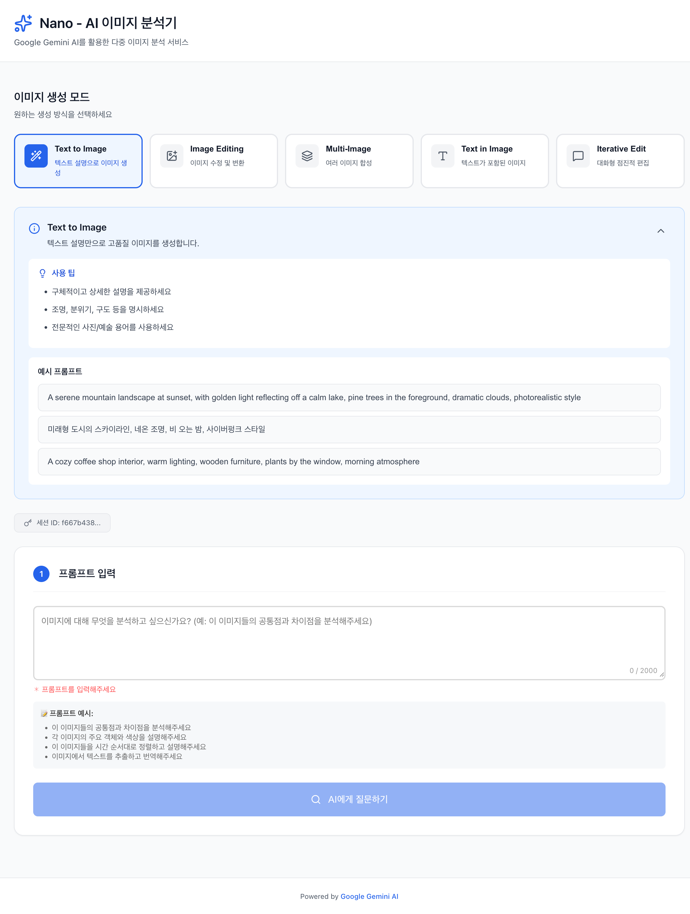

# 🍌 Nano

> Google Gemini를 활용한 AI 기반 이미지/동영상 생성 플랫폼
(nano banana & veo3)

## ✨ 주요 기능

### 🍌 Nano Banana (이미지 생성 & 분석)
- 📸 **다중 이미지 분석** - 최대 5개 이미지 동시 분석
- 🎨 **AI 이미지 생성** - Text-to-Image, Image Editing 등 5가지 모드
- 🤖 **AI 기반** - Google Gemini 2.5 Flash Image 활용
- 🚀 **빠른 처리** - 10초 이내 결과 제공
- 🎨 **직관적 UI** - 드래그 앤 드롭 인터페이스와 실시간 피드백

### 🎬 Veo3 (동영상 생성)
- 🎥 **AI 동영상 생성** - 텍스트 설명으로 8초 동영상 생성
- 🎬 **고화질** - 720p 또는 1080p 해상도 지원
- 🔊 **네이티브 오디오** - 자동으로 오디오가 포함된 동영상 생성
- 🖼️ **이미지 기반 생성** - 시작 프레임 이미지로 애니메이션 생성
- ⚙️ **커스터마이징** - 화면 비율(16:9, 9:16), Negative Prompt 지원

### 공통 기능
- 🔒 **보안** - 임시 파일 저장 및 자동 정리
- 📱 **반응형** - 데스크톱과 모바일 모두 지원
- 🎯 **탭 기반 UI** - Nano Banana와 Veo3를 명확하게 분리

## 📸 스크린샷



## 🛠️ 기술 스택

### Frontend
- React 19 + TypeScript
- Axios (API 통신)
- react-dropzone (파일 업로드)
- Lucide React (아이콘)

### Backend
- Node.js 18+ + Express.js
- Google Gemini API SDK
- Multer (파일 처리)
- Winston (로깅)

### Testing
- Jest (단위 & 통합 테스트)
- Cypress (E2E 테스트)
- Supertest (API 테스트)

## 🚀 빠른 시작

### 사전 요구사항
- Node.js 18 이상
- Google Gemini API 키 ([여기서 발급](https://ai.google.dev/))

### 설치 방법

1. 저장소 클론
```bash
git clone https://github.com/yourusername/nano.git
cd nano
```

2. 백엔드 설정
```bash
cd backend
npm install
```

3. 백엔드 디렉토리에 `.env` 파일 생성
```env
GOOGLE_API_KEY=your_gemini_api_key_here
PORT=3000
```

4. 프론트엔드 설정
```bash
cd ../frontend
npm install
```

### 애플리케이션 실행

두 서버를 동시에 실행하세요:

**터미널 1 - 백엔드:**
```bash
cd backend
npm run dev
```

**터미널 2 - 프론트엔드:**
```bash
cd frontend
npm start
```

애플리케이션 접속 주소:
- 프론트엔드: http://localhost:3001
- 백엔드 API: http://localhost:3000

## 📁 프로젝트 구조

```
nano/
├── backend/
│   ├── src/
│   │   ├── api/           # Express 라우트 & 미들웨어
│   │   ├── services/      # 비즈니스 로직 (Gemini, File)
│   │   ├── models/        # 데이터 모델
│   │   └── lib/           # 핵심 라이브러리
│   └── tests/             # 테스트 스위트
├── frontend/
│   ├── src/
│   │   ├── components/    # React 컴포넌트
│   │   ├── pages/         # 페이지 컴포넌트
│   │   ├── services/      # API 클라이언트
│   │   └── hooks/         # 커스텀 React 훅
│   └── tests/             # 컴포넌트 테스트
└── specs/                 # API 명세
```

## 🧪 테스트

전체 테스트 실행:
```bash
# 백엔드 테스트
cd backend
npm test

# 프론트엔드 테스트
cd frontend
npm test

# E2E 테스트
npm run test:e2e
```

## 📝 API 문서

RESTful API 규칙을 따릅니다. 주요 엔드포인트:

- `GET /api/v1/health` - 헬스 체크
- `POST /api/v1/images` - AI 이미지 분석


## 🔐 보안

- API 키는 서버에서만 관리
- 업로드 파일 MIME 타입 검증
- 파일 크기 제한 (이미지당 5MB, 총 20MB)
- 자동 세션 정리
- 요청 속도 제한 적용

## 🎯 제약사항

- 요청당 최대 5개 이미지
- 지원 형식: JPEG, PNG, WebP, GIF
- 프롬프트 길이: 1-2000자
- 분석 타임아웃: 10초

## 🚀 배포 (Google Compute Engine)

회사 팀원들과 공유하기 위해 GCE에 배포하는 방법입니다.

### 빠른 배포 가이드

**1. GCE 인스턴스에서 서버 초기 설정:**
```bash
# 프로젝트 클론
git clone https://github.com/yourusername/nano.git
cd nano

# 서버 환경 자동 설정 (Docker, Git 등)
./scripts/setup-gce-server.sh

# 재로그인 (Docker 권한 적용)
exit
# SSH 재접속 후
cd nano
```

**2. 환경 변수 설정:**
```bash
# 프로덕션 환경 변수 파일 생성
cp .env.production.example .env.production

# 필수 값 입력
nano .env.production
# - GEMINI_API_KEY: 실제 Gemini API 키
# - REACT_APP_API_URL: http://YOUR_GCE_EXTERNAL_IP:3000
# - SESSION_SECRET: 강력한 랜덤 문자열 (32자 이상)
```

**3. 배포 실행:**
```bash
# 자동 배포 스크립트 실행
./scripts/deploy-gce.sh
```

**4. 접속:**
- Frontend: `http://YOUR_GCE_EXTERNAL_IP`
- Backend API: `http://YOUR_GCE_EXTERNAL_IP:3000`

### 관리 명령어

```bash
# 로그 확인
docker compose -f docker-compose.prod.yml logs -f

# 재시작
docker compose -f docker-compose.prod.yml restart

# 중지
docker compose -f docker-compose.prod.yml down

# 업데이트 배포
git pull
./scripts/deploy-gce.sh
```

### GCE 인스턴스 권장 사양
- **타입**: e2-medium (2 vCPU, 4GB RAM) 이상
- **OS**: Ubuntu 22.04 LTS
- **디스크**: 20GB 이상
- **방화벽**: HTTP (80), TCP (3000), SSH (22) 포트 오픈

### 보안 설정
- **방화벽**: 회사 IP 대역만 허용 (GCP Console > VPC network > Firewall)
- **환경 변수**: `.env.production` 파일 권한 제한 (`chmod 600`)
- **HTTPS**: 도메인 연결 시 Let's Encrypt SSL 인증서 권장

📚 **자세한 배포 가이드**: [docs/DEPLOYMENT.md](docs/DEPLOYMENT.md)

## 📄 라이선스

ISC
